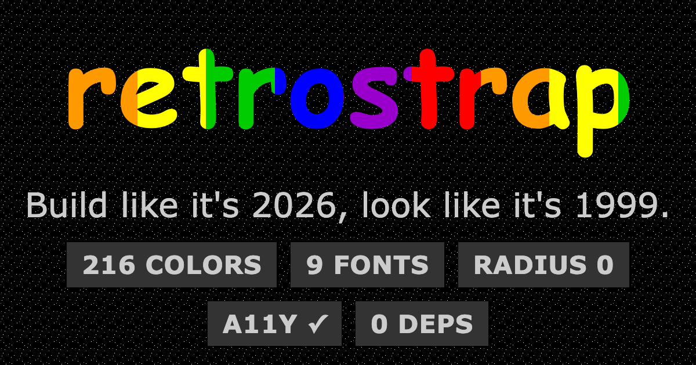

# retrostrap

```
 ╔═════════════════════════════════════════════════════════════════════════╗
 ║   * : . : ' ~ ' : . : *   r e t r o s t r a p   * : . : ' ~ ' : . : *   ║
 ║                Build like it's 2026, look like it's 1999.               ║
 ╚═════════════════════════════════════════════════════════════════════════╝
                 [ under construction, and proud of it ]
```

<p align="center">
  
</p>

**retrostrap** is a CSS + JavaScript framework for building websites that look like the
web of 1996-2003, GeoCities homepages, system-gray desktops, glitter shrines, green
terminals, while behaving like the modern web: responsive on every screen size,
accessible, fast, zero dependencies, installable from a CDN in two tags (four with a
theme and the Toybox, as below).

It ships in two parts:

- **The styling framework**: sixty-plus components (bevel buttons, window chrome,
  marquees, hit-counter shells, webring bars, folder tabs, "You are here:" breadcrumbs…),
  ten themes, and layout recipes that quietly collapse to phones.
- **The Toybox**: twenty-two optional widgets: a pixel cat that chases your cursor,
  falling snow, cursor trails, shiny spheres that trail your mouse in a rainbow, a little
  pet you feed, hit counters, a jukebox that never autoplays, and a konami code that
  starts a 30-second party.

Around the framework: thirty-four **demo sites** you can view-source, among them a
drag-and-drop **page builder** and **Retrospace**, a curated directory for the
community; plus an **MCP server** so coding assistants build era-correct pages on the
first try.

The trick that holds it together: the era's *constraints* are enforced as design law,
only the 216 web-safe colors (+16 named), nine period font stacks, `border-radius: 0`,
`linear`/`steps()` easing only. Stay inside the framework and you *cannot* accidentally
look modern. Meanwhile everything underneath is current-year engineering: semantic HTML,
real focus order, `prefers-reduced-motion`, performance budgets, progressive enhancement.

## Status

**It's all built and tested**: the CSS (63 components, ~7KB gzipped), the widget engine with
a live `Retrostrap.audit()`, the ten themes and twenty-two widgets, the demos, the builder,
Retrospace, and a docs site that dogfoods the lot. Not yet on npm; that waits on a version
bump. The full blueprint lives in `docs/` (design laws, catalogs).

## Quick start

```html
<!DOCTYPE html>
<html lang="en" data-rs-theme="midnight">
<head>
  <meta charset="utf-8">
  <meta name="viewport" content="width=device-width, initial-scale=1">
  <link rel="stylesheet" href="https://cdn.jsdelivr.net/npm/retrostrap@0.1.0/dist/retrostrap.min.css"
        integrity="sha384-TyyT7UOQybGpE6mx4ld8KKa1fJ0V9iTL+SgrYsR+3slTsBrMhPTkyU7VLv4s1vRW" crossorigin="anonymous">
  <link rel="stylesheet" href="https://cdn.jsdelivr.net/npm/retrostrap@0.1.0/dist/themes/midnight.css"
        integrity="sha384-Kc8YtDRZXSryk4ZOwocWPSWXa0ZpP3lKyrjc3svAzpQE6CEIx4a3zb/rbOPlCqNd" crossorigin="anonymous">
  <script defer src="https://cdn.jsdelivr.net/npm/retrostrap@0.1.0/dist/retrostrap.min.js"
          integrity="sha384-0kbx+lRlzcma2oceD32mzBUGyIGYY84l7SMnhd3vLbMKpbmDXdIljCeEPgmwWhpr" crossorigin="anonymous"></script>
  <script defer src="https://cdn.jsdelivr.net/npm/retrostrap@0.1.0/dist/retrostrap-toybox.min.js"
          integrity="sha384-LiKuF4yjYyIJjCsMqZ9xvyt2l5TgIZ7gxaACxYbWeJM/ybDOANEaXe4/qPDw2VWo" crossorigin="anonymous"></script>
</head>
<body data-rs-widgets="snowfall neko" data-rs-neko-behavior="patrol">
  <div class="rs-page rs-container">
    <h1 class="rs-rainbow rs-text-center">Welcome to my Homepage!</h1>
    <p class="rs-text-center"><span class="rs-badge rs-badge--new rs-blink">NEW!</span>
       You are visitor <span class="rs-counter" data-rs-widgets="hit-counter">001337</span></p>
  </div>
</body>
</html>
```

**New here?** The [Get started guide](docs/99-get-started.md) is the short path: the two-tag
install, npm, dropping into React/Vue/Svelte, a full page skeleton, themes, and verifying
with `Retrostrap.audit()`.

## The documentation

[Get started](docs/99-get-started.md) is the quickest path onto the air. For the whole
picture, start with the [vision](docs/00-vision.md), then wander:

<details>
<summary>The full documentation index</summary>

| | |
| --- | --- |
| [Get started](docs/99-get-started.md) | install, frameworks, first page, themes, audit |
| [00 · Vision](docs/00-vision.md) | what, why, principles, non-goals |
| [01 · The Museum](docs/01-history-research.md) | how the old web really looked, researched |
| [02 · Design language](docs/02-design-language.md) | **the five laws**, tokens, guardrails |
| [03 · Architecture](docs/03-architecture.md) | repo, build, catalog system, asset pipeline |
| [04 · Components](docs/04-components.md) | the full catalog |
| [05 · The Toybox](docs/05-widgets.md) | widget catalog + the ten-rule contract |
| [06 · JavaScript API](docs/06-javascript-api.md) | the whole surface |
| [07 · Theming](docs/07-theming.md) | ten themes, token matrix |
| [08 · A11y & performance](docs/08-accessibility-performance.md) | the modern conscience |
| [09 · AI integration](docs/09-ai-integration.md) | llms.txt, manifest, MCP server |
| [10 · Demo sites](docs/10-demo-sites.md) | 34 demos + the docs site |
| [11 · The Boards](docs/11-community-forum.md) | forum spec, Netiquette (EN + DE) |
| [12 · Retrospace](docs/12-retrospace.md) | the curated directory |

</details>

## See it running

Live on [retrostrap.dev](https://retrostrap.dev): the docs (built with retrostrap, of
course), [the kitchen sink](https://retrostrap.dev/kitchen-sink/) with every component on
one page, and [thirty-four demo sites](https://retrostrap.dev/demos/), among them the
drag-and-drop [page builder](https://retrostrap.dev/demos/builder/) and
[Retrospace](https://retrostrap.dev/demos/retrospace/), our curated directory of the
living retro web.

The same pages live in this repo, view-source-able and offline-friendly:
[`demos/`](demos/index.html) holds the gallery, a personal homepage, a pizzeria, an ISP's
NOC, a webcomic, a band shrine, an online store, and more. Screenshots at three viewports
are in [`site/assets/shots/`](site/assets/shots/).

## Community

**[The Retrostrap Boards](https://boards.retrostrap.dev)** launch with the project: a
slow, friendly forum with a Netiquette, no like buttons, and a German-language table,
**Der Stammtisch**, built with retrostrap and run on our own little stack. One community,
one home; GitHub stays for issues and pull requests. Be kind; greet the newbies;
remember the human.

Built something? Wear the badge:


## For robots

Machine-readable everything: `llms.txt`, a one-page cheatsheet, `manifest.json`,
`guardrails.json`, a prompt pack, and an MCP server ([`services/mcp/`](services/mcp/))
that hands assistants the catalog as tools, so they build era-correct pages on the first
try. See [docs/09](docs/09-ai-integration.md).

## Who makes this

retrostrap is built and maintained by [Stefan Gündhör](https://stg.social): a business
informatics degree (JKU Linz, 2012) and hands-on web and backend engineering since long
before generative AI went public. It is published under his Austrian one-person company,
[vorausgedacht.at e.U.](https://vorausgedacht.at) Modern tools, generative AI among
them, are part of the workshop here; nothing ships without human technical judgment and
a manual review. The retro is the look, not the engineering standard.

## License

MIT (the [LICENSE](LICENSE) file).

---

*This page is best viewed with any browser, at any size. That's the whole point.*
